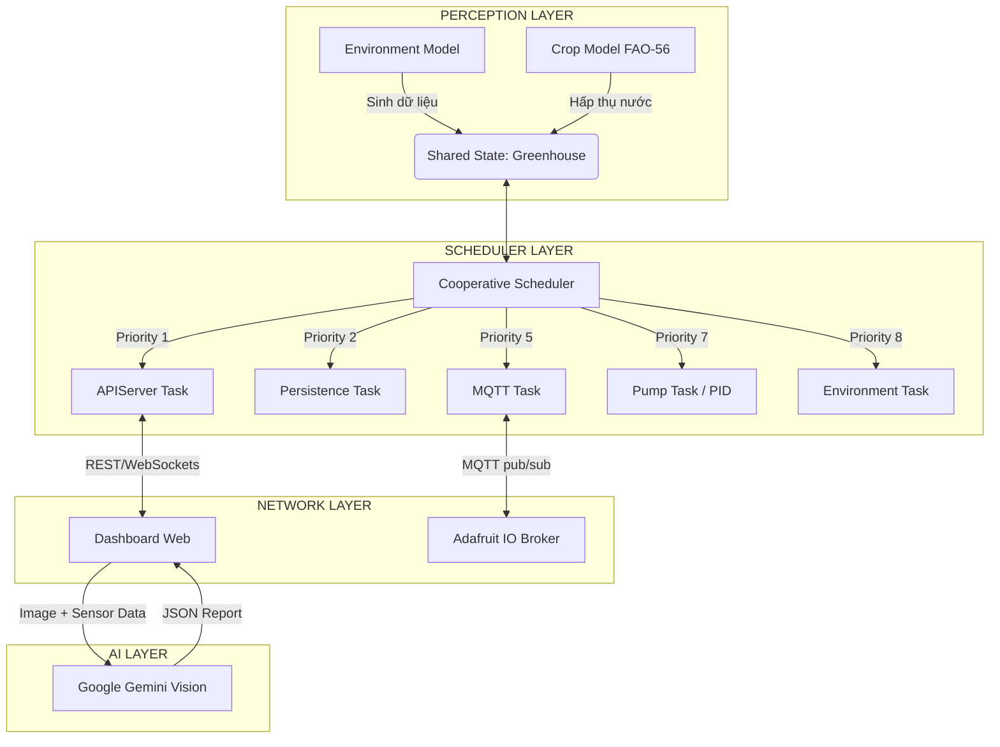

<div align="center">


<br/>


<br/>

> **Hệ thống IoT mô phỏng nhà kính nông nghiệp thông minh** — Tích hợp cảm biến môi trường nâng cao (EC, pH, Nhiệt, Ẩm), mô hình quang hợp cây trồng (FAO-56), lõi định tuyến RTOS-style, thuật toán PID bơm nước, và tích hợp AI Agronomist chuyên sâu phân tích hình ảnh kết hợp dữ liệu môi trường.

<br/>

[](dashboard/index.html)
[](dashboard/ai_camera.html)

</div>

---

## 📑 Mục lục

- [Tổng quan hệ thống](#-tổng-quan-hệ-thống)
- [Kiến trúc IoT & Backend](#-kiến-trúc-iot--backend)
- [Hệ thống Cảm biến (Sensor Models)](#-hệ-thống-cảm-biến-sensor-models)
- [Cooperative Scheduler (RTOS-style)](#-cooperative-scheduler-rtos-style)
- [Dashboard & AI Vision Core](#-dashboard--ai-vision-core)
- [Cài đặt & Vận hành](#-cài-đặt--vận-hành)
- [Cấu trúc dự án](#-cấu-trúc-dự-án)
- [Cấu hình môi trường](#-cấu-hình-môi-trường)

---

## 🌱 Tổng quan hệ thống

**Nhà Kính Thông Minh VIP PRO** là một hệ thống giải pháp IoT phần mềm toàn diện mô phỏng một môi trường nông nghiệp thông minh công nghệ cao. Thay vì phụ thuộc vào phần cứng vật lý, dự án cung cấp một **Bộ giả lập môi trường học** cực kỳ chân thực (Dựa trên mô hình FAO-56 và các tiêu chuẩn IEC), liên kết trực tiếp với Frontend Dashboard thông qua luồng dữ liệu **REST API, WebSockets và MQTT**.

### ✨ Tính năng Nổi bật

| Tính năng | Mô tả |
|-----------|-------|
| 🔬 **7 Cảm biến Sinh thái** | Độ ẩm đất, Nhiệt độ, Ánh sáng, Độ ẩm KK, CO₂, **EC (Độ dẫn điện), pH**. |
| 🌍 **Mô hình Khí hậu & Đất** | Giả lập chu kỳ ngày đêm, biến động thời tiết, tán cây quang hợp (FAO-56 WSI). |
| 🎛️ **PID Controller** | Thuật toán PID điều khiển bơm nước để duy trì chính xác độ ẩm mục tiêu. |
| 📡 **Đa giao thức Network** | Kết nối MQTT (Adafruit IO) song song cùng **FastAPI (REST + WebSockets)**. |
| 🚀 **RTOS Scheduler** | Core vận hành theo kiến trúc Cooperative Multitasking với các Queue ưu tiên. |
| 📊 **VIP Dashboard UI** | Bảng điều khiển siêu mượt (Vanilla JS), Dark Mode, Multi-line Chart.js. |
| 🤖 **AI Agronomist (Vision)** | Kết hợp TensorFlow.js và **Gemini Vision**, phân tích bệnh cây trồng từ Ảnh + Cảm biến thời gian thực. |
| 🐳 **Dockerization** | Deploy nhanh chóng toàn bộ stack chỉ với 1 câu lệnh qua Docker Compose. |

---

## 🏗️ Kiến trúc IoT & Backend

Hệ thống được thiết kế theo nguyên lý Modularity, tách biệt rõ ràng giữa Business Logic (Simulator/Models) và Network Interface.



---

## 🔬 Hệ thống Cảm biến (Sensor Models)

Các mô hình môi trường học được xây dựng dựa trên sự tương quan logic giữa các yếu tố vật lý và hóa học:

1. **Nhiệt độ & Ánh sáng**: Biến đổi hình Sin theo chu kỳ thời gian trong ngày. Ánh sáng bị giới hạn bởi thời tiết ngẫu nhiên (Mây, Mưa).
2. **Độ ẩm đất & Crop Water Stress Index (WSI)**: Hấp thụ nước dựa vào giai đoạn sinh trưởng của cây trồng (Initial, Mid-season, Late-season) theo bộ chuẩn FAO-56.
3. **Độ dẫn điện (EC - Electrical Conductivity)**: Tích hợp hiệu ứng pha loãng khi bơm tưới (Dilution Effect) và cô đặc khi bay hơi (Concentration Effect). Ảnh hưởng trực tiếp bởi nhiệt độ bù trừ.
4. **Độ pH**: Giả lập sự trượt pH tự nhiên khi mưa acid, bón phân và khả năng đệm của đất.
5. **Độ ẩm KK & CO₂**: Giảm CO₂ ban ngày do quang hợp và tăng ban đêm do hô hấp.

---

## ⚙️ Cooperative Scheduler (RTOS-style)

Backend Python không sử dụng vòng lặp `while True` thô sơ mà sử dụng **Cooperative Scheduler** quản lý đa tiến trình không đồng bộ:
- Giảm thiểu Blocking IO.
- Task có `priority` (Độ ưu tiên) và `interval` (Chu kỳ gọi).
- Cơ chế Dependency: Ví dụ `PumpTask` phụ thuộc vào `EnvironmentTask` để có dữ liệu cảm biến mới nhất trước khi ra quyết định bật bơm.
- Tích hợp Watchdog theo dõi Health Check của từng Task.

---

## 🌟 Dashboard & AI Vision Core

Trái tim tương tác của người dùng đặt ở thư mục `dashboard/` - không cần bất kỳ framework frontend nặng nề nào (React/Vue), hoàn toàn tối ưu bằng Vanilla JS, CSS3 Variables và HTML5.

### Tính năng VIP PRO:
- **Biểu đồ Multi-Line**: Gom toàn bộ thông số 7 loại cảm biến lên một trục không gian duy nhất để đánh giá tính tương quan (Ví dụ: khi Nhiệt độ tăng, Độ ẩm giảm).
- **Cảnh báo Flash Effect**: Cập nhật thời gian thực bằng WebSocket, UI sẽ "chớp sáng" và hiển thị các mũi tên xu hướng (Trend Indicators) rất mượt.
- **Bộ điều khiển Bơm & PID**: Cho phép switch đổi giữa chế độ `AUTO` và `MANUAL`, kéo slider điều chỉnh ngưỡng tưới, xem output thuật toán PID live.
- **Nhật ký & Lịch sử**: Ghi nhận toàn bộ thao tác bơm, canh báo hệ thống.

### 🤖 AI Agronomist (Chuyên Gia Nông Nghiệp Ảo)
Thay vì các chức năng AI chung chung, dự án xây dựng một AI Vision Core:
1. **Trạm phân loại nhanh (TensorFlow.js)**: Chạy cục bộ trên trình duyệt nhận diện lá cây.
2. **Phân tích chuyên sâu (Gemini Vision 1.5)**: Khi user bấm phân tích, Dashboard không chỉ gửi hình ảnh, mà còn **đóng gói toàn bộ Sensor Context (Temp, pH, EC...) tại thời điểm đó** gửi lên mô hình Gemini.
3. **Kết quả JSON chuẩn xác**: AI Agronomist trả về báo cáo chi tiết về tình trạng sâu bệnh, nguyên nhân do môi trường, và khuyến nghị tưới tiêu.

---

## 🚀 Cài đặt & Vận hành

Hệ thống được thiết kế để triển khai siêu tốc.

### Cách 1: Chạy bằng Docker (Khuyến nghị)
Yêu cầu đã cài đặt Docker & Docker Compose.
```bash
git clone <repository>
cd IotNhaKinh
# Đổi tên file cấu hình
cp simulator/.env.example simulator/.env 

# Chạy hệ thống
docker-compose up -d --build
```
Vào `http://localhost:8080/api/sensors` để kiểm tra backend.
Mở trực tiếp file `dashboard/index.html` trên trình duyệt để sử dụng.

### Cách 2: Chạy trực tiếp với Python
Yêu cầu Python 3.10+
```bash
cd IotNhaKinh/simulator

# Cài đặt môi trường ảo (tùy chọn)
python -m venv venv
source venv/bin/activate  # Hoặc venv\Scripts\activate trên Windows

# Cài thư viện
pip install -r requirements.txt

# Tạo file cấu hình và điền Key
cp .env.example .env

# Khởi chạy Simulator & API Server
python main.py
```

---

## 📂 Cấu trúc dự án

```text
📦 IotNhaKinh
 ┣ 📂 dashboard               # Lớp Frontend Web (Không cần build, mở lên là chạy)
 ┃ ┣ 📂 css                   # Chứa style.css, dark theme, animations
 ┃ ┣ 📂 js                    # Chứa Logic (uiController, mqttService, chartManager, gemini_vision)
 ┃ ┣ 📜 index.html            # Trang giám sát chính
 ┃ ┗ 📜 ai_camera.html        # Trang phân tích AI Agronomist
 ┣ 📂 simulator               # Lớp Backend Python
 ┃ ┣ 📂 models                # Các mô hình Toán Học (Greenhouse, Crop, EC, pH)
 ┃ ┣ 📂 tasks                 # Các quy trình Task cho Scheduler
 ┃ ┣ 📜 config.py             # Quản lý file cấu hình
 ┃ ┣ 📜 main.py               # Entrypoint Backend
 ┃ ┗ 📜 requirements.txt      # Dependency Python
 ┣ 📜 docker-compose.yml
 ┣ 📜 Dockerfile
 ┗ 📜 README.md               # You are here
```

---

## ⚙️ Cấu hình môi trường

Tạo file `simulator/.env` và thiết lập các API keys nếu bạn cần sử dụng Adafruit IO và Gemini.
Lưu ý: Mọi tham số đều có thể để trống (Trừ Gemini Key nếu bạn muốn xài chức năng AI Camera). Dự án đã tích hợp FastAPI WebSocket để đảm bảo kết nối nội bộ mượt mà kể cả khi không có MQTT Cloud.

```env
# Adafruit IO Credentials (Để trống nếu chỉ dùng WebSockets nội bộ)
ADAFRUIT_USERNAME=your_username
ADAFRUIT_KEY=your_aio_key

# (Không yêu cầu Gemini Key ở Backend, Key được nhập trực tiếp qua UI Dashboard)
```

<div align="center">
  <b>Phát triển bởi đội ngũ Đam Mê IoT 💚 & Trí Tuệ Nhân Tạo 🤖</b>
</div>
